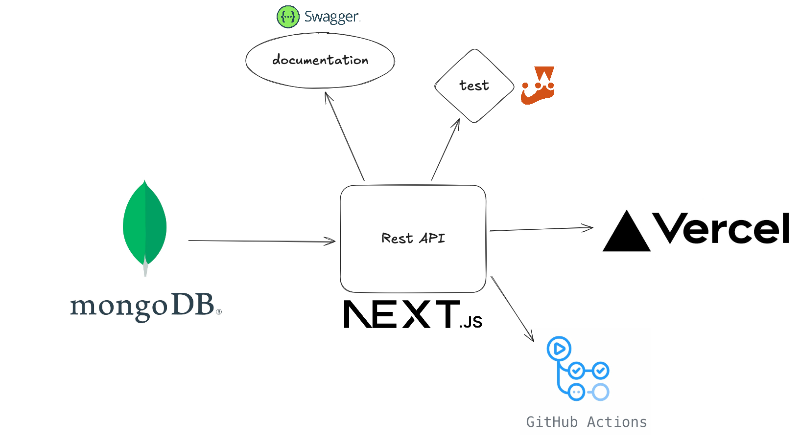

# Mflix Next.js/MongoDB/Vercel

## Introduction

This project is a REST API interactig with data in a MongoDB Atlas database, using Vercel platform to be hosted online [here]([https://vercel.com/llegits-projects/mflix-next-js-project/55U13456faZZ7WXLHDdGczDZFdpc](https://mflix-next-js-project-git-master-llegits-projects.vercel.app/).

## Architecture

## What's inside
- Api routes like /api/movies using the Next.js routing system
- Swagger documentation at /api-doc
- Authentication using Jose library (JWT) and HTTP cookies
- Unit testing with Jest
- CI/CD with Github Actions

## Setup
- Copy the `.env.local.example` in a  `.env.local` with the correct values
- Make sure you have Node.js installed and run `npm install`
- Then run `npm run dev` to access http://localhost:3000
